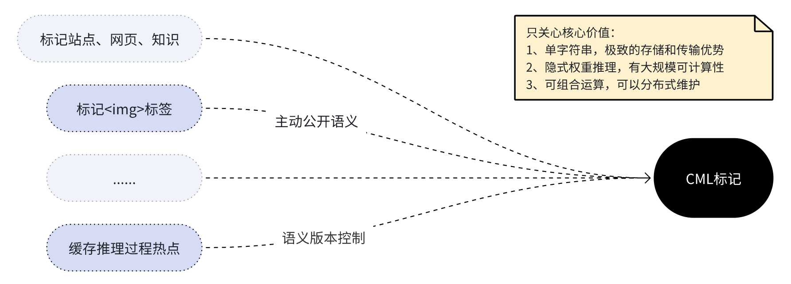

# CML

上下文标记语言CML(Context Mark Language)的核心语法编解码的go实现。

## Quick Start

```go
import "github.com/contextMark/cml-go"
cDouble,_ := cml.New([]string{
    "万有引力",":","牛顿","+","自然哲学的数学原理","@","1687 年"
})
cmlA, _ := cDouble.EncodeA()
fmt.Println(cmlA)
```

## What is CML

CML **不是**：
- ❌ JSON / YAML 的替代品
- ❌ 图数据库
- ❌ 自然语言
- ❌ LLM Prompt 语法糖

✅CML是语义时代的Markdown。它的目标是让兼具人类可读和机器可运算特征的关系结构片段，成为**可大规模计算**、**任意传输**、**分布式存储**的语义中间层。

## What problem does CML solve?

CML 提供了一种 介于自然语言与图库结构之间的**语义存储方式**。

CML 解决的问题是：

- 将1维、模糊的自然标记语言的主干关系，转换成1.5维、显式、可分形的动态标记，提供**大规模的可计算性**
- 当你希望向LLM主动公开知识的语义，你会发现自然语言过于模糊无法一致性计算，JSON/Graph又过于静态，**表达效率**和**传输**、**嵌入**都不友好。


## Use Cases

CML语言语法层，以**单字符串编码的优势**为中心，专注纯粹、极简、跨媒介、可运算的特性：

比如上图，就可以通过html的标签属性，来主动公开明确的图片语义,让LLM更好的推断。

```html

```

也可以通过markdown规范来零成本兼容承载：

```markdown

```

## Encoding & Decoding

本框架只提供三类能力：
* cml字符串和语义基元之间的互转（语法层方法）
* cml字符串和自然语言、数组之间的互转（上层内置）

- 编码在不同模式之间互转
```go
//支持4种等价的编码模式，分别面向普适性、大规模性能、低熵不可读性、最低熵
func IsCML(encoded string) error   //验证CML是否合法
func CML2A(encoded string) (string, error)   //转换成a模式存储，双层Base58
func CML2C(encoded string) (string, error)   //转换成c模式存储，双层Base64URL
func CML2P(encoded string) (string, error)   //转换成p模式存储, 单层明文混编
func CML2Q(encoded string) (string, error)   //转换成q模式存储, 双层混编
```

- 编码转基元序列
```go
//中间结构转换
func CML2Elements(encoded string) (*CMLSingle, error) //将cml编码解析为基元序列
func CML2Fragments(encoded string) (*CMLDouble, error) //将cml编码解析为双序列
//上层markdown转换
func ToMarkdown(encoded string) string //将cml编码转换成md反引号格式
func FromMarkdown(md string) ([]string,error)  //将反引号编码的md格式转换成基元序列
func New(slice []string) (*CmlFragments, error)    //手动构造
```

- 基元序列的构造、验证、编码
```go
//基元类型抽象的单序列
//- 单序列<token>，<separator>，<token>，<separator>，...<token>
func (e *CMLSingle) EncodeA() (string, error)
func (e *CMLSingle) EncodeC() (string, error)
func (e *CMLSingle) EncodeP() (string, error)
func (e *CMLSingle) EncodeQ() (string, error)
func (e *CMLSingle) IsValid() error

//基元类型的分类双序列编码
//- 奇数序列<token>，<token>，...<token> 
//- 偶数序列<separator>，<separator>，...<separator>
func (f *CMLDouble) EncodeA() (string, error)
func (f *CMLDouble) EncodeC() (string, error)
func (f *CMLDouble) EncodeP() (string, error)
func (f *CMLDouble) EncodeQ() (string, error)
func (f *CMLDouble) IsValid() error
```
## Documentation

本项目采用MIT宽松授权。本项目是对标记语言 Context Mark Language (CML)规范的标准实现，未做语法演绎，也不影响语言本身的过渡条款。

原始语言文档 ：[doc-war.com/CML](https://doc-war.com/CML/)

原始协议仓库链接：https://github.com/ContextMark/CML